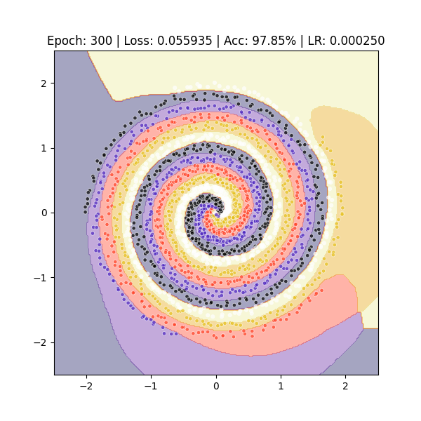

# NeuraKitten
A lightweight, NumPy-based Multi-Layer Perceptron (MLP) implementation built from scratch for educational purposes.

A Python-based deep learning project that demonstrates how a simple neural network can learn complex circular and spiral shapes. The project highlights the power of Feature Engineering by transforming Cartesian coordinates into Polar coordinates to achieve high-precision boundary classification.

Key Features
    Custom Data Factory: Generates "Donut" and "Spiral" datasets with adjustable noise and density.

    Polar Feature Engine: Implements a transformation layer that converts (x,y) coordinates into (r,sin(ϕ),cos(ϕ)) for smoother boundary learning.
    Why Polar? By converting $(x, y)$ to $(r, sin(phi), cos(phi)), we linearize circular boundaries, allowing a simpler network to achieve 99%+ accuracy much faster.

    Live Visualization: Real-time plotting of the decision boundary and loss convergence during training.

    Modular Architecture: Clean separation between model logic, data processing, and training loops.

Project Structure
NeuraKitten/
├── src/
│   ├── __init__.py
│   ├── data_utils.py       # DataFactory, FeatureEngine, DataScaler
│   ├── model.py            # DeepNeuralNetwork class
│   ├── trainer.py          # Training loop (fit function)
│   └── visualization.py    # Live plotting logic (live_plot)
├── main.py                 # Main entry point
├── requirements.txt        # Project dependencies
└── README.md               # Project documentation

Getting Started
    Prerequisites
        Python 3.8+
        pip (Python package manager)

    Installation
        1. Clone the repository:
            git clone https://github.com/semant01/NeuraKitten.git
            cd NeuraKitten

        2. Create and activate a virtual environment:
            python -m venv .venv
				# On Windows:
				.venv\Scripts\activate
				# On macOS/Linux:
				source .venv/bin/activate

        3. Install dependencies:
            pip install -r requirements.txt

    Running the Project
        Simply execute the main script to start the training and visualization:
        python main.py

	Configuration.
		You can modify main.py to switch between datasets or adjust the learning rate:
			Change dataset='donut' to dataset='spiral' to see the network tackle more complex shapes.
			Adjust noise_level to test the model's robustness

Tech Stack
    NumPy: Matrix operations and data generation.
    Matplotlib: Real-time visualization.
    Python: Core logic and OOP architecture.